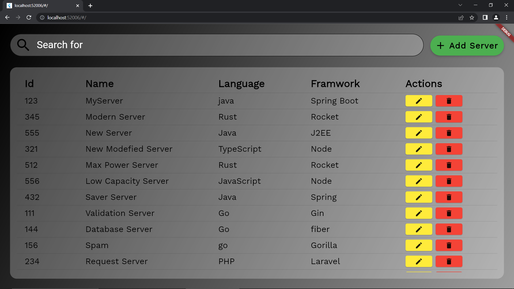
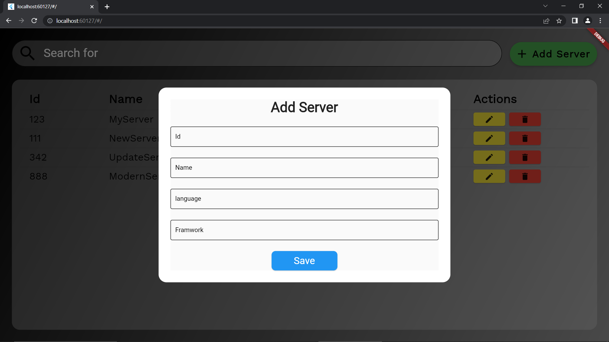
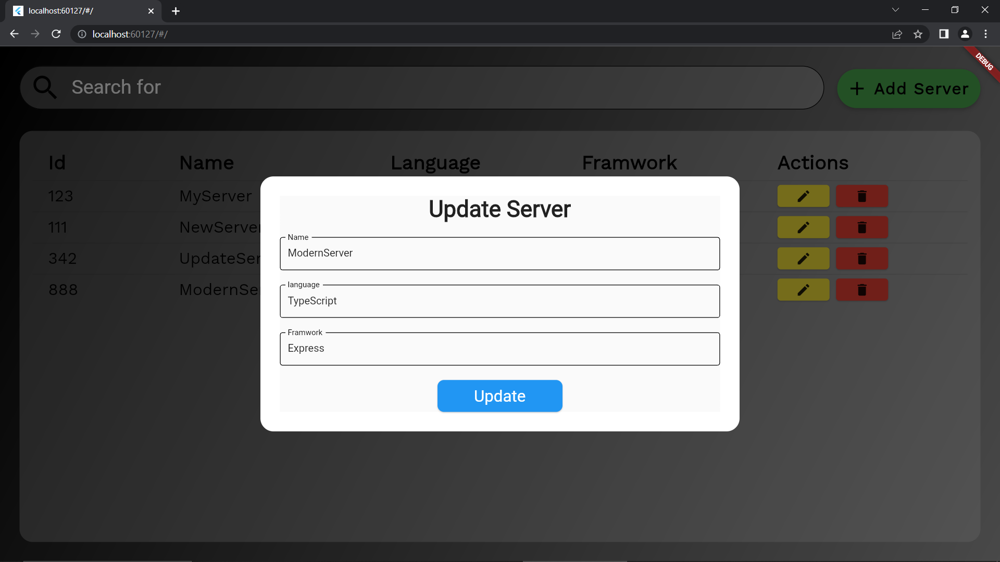
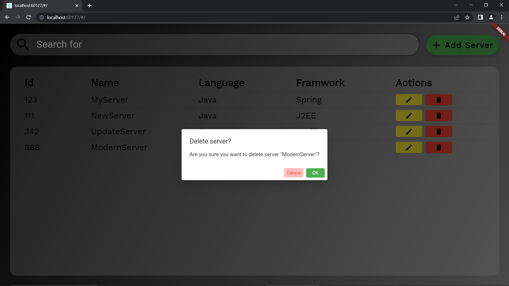
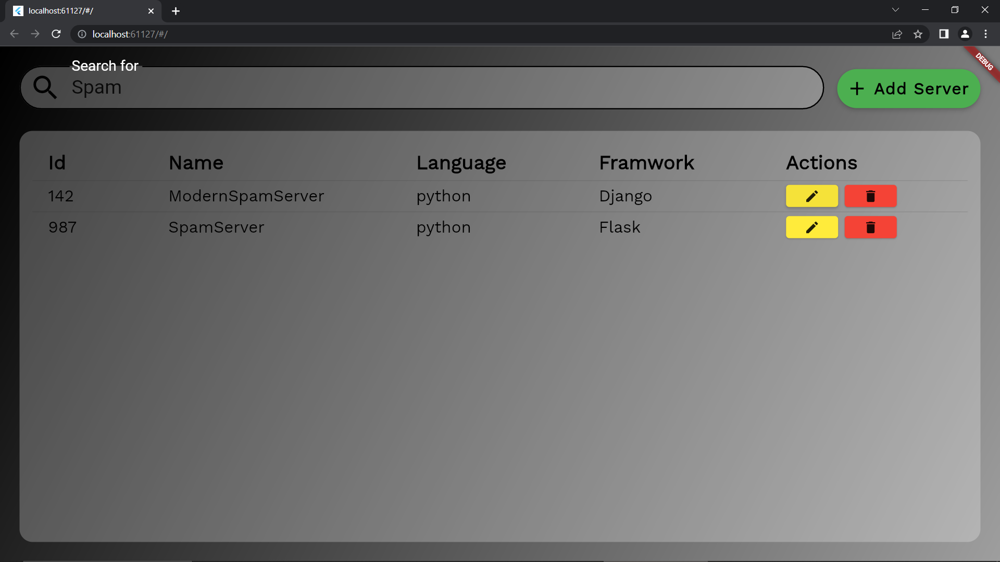

# Server Manager Client
Server Manager Client is a web application built with Flutter that allows users to manage servers by displaying them in a data table. Users can add, delete, or edit any server.

This project is the front-end or client side application for [Keima483/server-manager-rest-api](https://github.com/Keima483/server-manager-rest-api) and it must be running for this project to work.

## Getting Started
### Prerequisites
* Flutter SDK 3.0.0+ installed on your machine
* A code editor, such as Visual Studio Code or Android Studio
* A web browser

### Installation
1. Clone the repository:
    ```bash
    git clone https://github.com/keima_483/server_manager_client.git
    ```
2. Open the project in your code editor.
3. Install the project dependencies:
    ```bash
    flutter pub get
    ```
4. Run the application:
    ```bash
    flutter run -d chrome
    ```

## Usage
### Displaying Servers
When the application loads, it displays all of the servers in a data table. Each row represents a single server and includes columns for the server's name, ID, language, and framework and if the server is not on a prompt is given.


### Adding a Server
To add a server, click the "+ Add Server" button at the top of the page. This will open a dialog box where you can enter the details for the new server. Click "Save" to add the server to the data table.


### Editing a Server
To edit a server, click the Edit button in the row for the server you want to edit. This will open a dialog box where you can make changes to the server's details. Click "Update" to update the server in the data table.


### Deleting a Server
To delete a server, click the Delete button in the row for the server you want to delete. This will prompt you to confirm that you want to delete the server. Click "OK" to delete the server from the data table.


### Search for Servers
To Search for a server just start typing the name on the searchbar on top and with ever letter typed the search result will be refreshed. You don't even have to type the full name just type the letters you know are you will get all the servers in whose name the letters are there.
